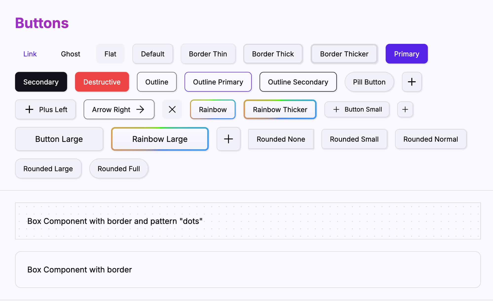

# Naut UI

A lightweight, Astro-native UI component library for marketing websites — not apps.

**Astro is the rocket; Naut UI is the gear.** Built for speed and designed for the modern web, Naut UI ships the core elements and marketing blocks you need to skip the scaffolding and get to your product.

No framework runtime, no build step, no preprocessor. Components are single-file `.astro` files with scoped CSS; design tokens derive at runtime via CSS `color-mix()` and OKLCH.

**Status:** In development.



## Installation

```bash
npm install @nautui/core @nautui/blocks
# or
pnpm add @nautui/core @nautui/blocks
# or
bun add @nautui/core @nautui/blocks
```

### Local Development

1. Clone the repo:
   ```bash
   git clone https://github.com/viirak/nautui.git
   cd nautui
   ```
2. Create a new Astro project (or use an existing one), then link the local @nautui packages:
   ```bash
   pnpm link <path-to-local-nautui>/packages/core
   pnpm link <path-to-local-nautui>/packages/blocks
   ```

## Usage

### 1. Theme

Add the Theme (provider) to your layout:

```astro
---
import { Theme } from "@nautui/core";
---

<html lang="en">
  <head>
    <meta charset="utf-8" />
    <meta name="viewport" content="width=device-width" />
    <title>My Site</title>
  </head>
  <body>
    <Theme>
      <slot />
    </Theme>
  </body>
</html>
```

### 2. Dark mode

Dark mode is enabled by default when you wrap your layout with `<Theme>`. Disable it with `dark={false}`:

```astro
<Theme dark={false}><slot /></Theme>
```

There's also a theme toggle component for switching between light and dark mode. To use it, import and place it in your page:

```astro
---
import { ThemeToggle } from "@nautui/core";
---
<header>
  <ThemeToggle />
</header>
```

### 3. Use Components

```astro
---
import { Button, Container, Section, Title, Text } from "@nautui/core";
---

<Section>
  <Container>
    <Title level={1}>Welcome</Title>
    <Text>Get started with Naut UI</Text>
    <Button variant="primary">Get Started</Button>
  </Container>
</Section>
```

## Theming

Naut UI is opinionated: you provide two brand colors, and the rest of the palette is derived from them at runtime using CSS `color-mix()` and OKLCH. No build step, no preprocessor.

### Constraint

`--naut-color-primary` and `--naut-color-secondary` **must meet a contrast ratio of ≥ 4.5:1 against white** (WCAG AA for normal text). The library assumes white text is readable on both, and renders primary / secondary / destructive surfaces with white text accordingly. You can verify a color with any WCAG contrast checker.

### Overriding tokens

After wrapping your layout with `<Theme>`, override any of the exposed tokens in a global `<style>` block or a CSS file loaded on the page:

```astro
<style>
  :root {
    /* Brand — required to meet ≥ 4.5:1 vs white */
    --naut-color-primary: #ffb000;
    --naut-color-secondary: #555522;

    /* Opinionated defaults — override only if you must */
    --naut-color-destructive: #ff2222;
    --naut-color-link: #0000ee;
    --naut-color-highlight: #ddd522;

    /* Tint controls (percentages) */
    --naut-tint-base: 3%;   /* primary bleed into surfaces */
    --naut-tint-strong: 25%; /* strong color-mix strength (hover/fills) */

    /* Typography */
    --naut-font-family: "Schibsted Grotesk", sans-serif;
  }
</style>
```

Only the tokens above are intended for override. Everything else (`--naut-color-base-*`, `--naut-color-content*`, `--naut-color-border*`, ...) is derived and updates automatically when the inputs change — including at runtime, so a brand-color picker Just Works.

### Browser support

Theming relies on `color-mix()`, `oklch()`, and relative color syntax (`rgb(from ...)`), all of which are Baseline 2024 (Chrome 119+, Safari 16.4+, Firefox 128+).

## Core Components (@nautui/core)

### Theming
- [x] Theme — provider that injects tokens and wires up auto dark mode
- [x] ThemeToggle — button that switches between light and dark and persists the choice

### Layout
- [x] Container — center content with padding and a max-width
- [x] Section — full-width page section with left/center/right zones and dark forcing
- [x] Box — low-level container for spacing, borders, corners, and backgrounds
- [x] Flex — flexbox helper with responsive direction and alignment
- [x] Stack — vertical stack with responsive align/justify and gap
- [x] Group — inline-flex row helper with justify, wrap, and responsive stacking
- [x] Grid — responsive 1–12 column grid with optional hairline dividers
- [x] GridItem — grid cell with responsive column spans
- [x] Bento — bento grid with configurable rows and columns
- [x] BentoItem — bento cell with row/column span
- [x] Masonry — CSS multi-column masonry grid
- [x] MasonryItem — masonry cell that avoids breaking across columns
- [x] Space — responsive spacer on the spacing scale
- [x] Visibility — show/hide content at breakpoints

### Content
- [x] Article — long-form content container with typographic defaults and copy-to-clipboard
- [x] Background — pattern or gradient background layer
- [x] Image — responsive image with ratio, cover, and shadow options
- [x] Marquee — infinite horizontal/vertical scroll ticker

### Elements
- [x] Button — link or button with 11 variants
- [x] Badge — pill label for status, counts, or tags
- [x] Card — surface container with 8 variants and hover states
- [x] Divider — horizontal or vertical rule
- [x] Mark — highlighted text with decorative variants
- [x] Link — themed anchor with hover states

### Typography
- [x] Title — semantic h1–h6 with a display scale and gradient text
- [x] Text — body text with size, weight, and variant colors

### Navigation
- [x] NavBar — sticky/autohide top navigation with auto-dark detection
- [x] Drawer — slide-in overlay panel with built-in toggle
- [x] Menu — navigation list with collapsible groups
- [x] MenuGroup — labeled, collapsible menu group
- [x] MenuItem — link item with active states
- [x] Accordion — collapsible content panels
- [x] AccordionItem — a single accordion section
- [x] List — styled ordered and unordered lists
- [x] ListItem — list item

## Block Components (@nautui/blocks)

- [x] SectionHero — full-width marketing hero with figure placement
- [x] Breadcrumb — semantic navigation trail
- [x] DocLayout — three-column docs page shell (nav / content / TOC)
- [x] TOC — table of contents with scroll-spy indicator
- [ ] Contact — contact form and info block
- [ ] Error pages — 404 and 500 templates
- [ ] Pricing — pricing plan comparison
- [ ] Carousel — horizontal slide carousel
- [ ] Blog — blog post list with pagination
- [ ] Post — blog post with metadata and author info
- [ ] Pagination — numbered or arrow pagination

## Icons

Recommended: [Lucide Icons](https://lucide.dev/guide/astro/).

## ⚓ Principles

Naut UI is built on the spirit of Aśu (Sanskrit for immediate/fast) and the Naut (the sailor navigating the Astro ecosystem). We follow these core pillars:

### 1. Speed First

Performance isn't an afterthought. By using Native CSS (Nesting & Layers) and Vanilla JS, we eliminate the bloat of heavy runtimes and utility frameworks. A lean ship is a fast ship.

### 2. Import and Forget

Your .astro files should stay clean. We encapsulate styles and scripts within our components so you can focus on content. Provide the props, and we'll handle the rigging.

### 3. Polite Theming

Customization without conflict. Using CSS Cascade Layers (@layer) and CSS Variables, we ensure that branding is as simple as redefining a token. No specificity wars, no !important.

## License

MIT
